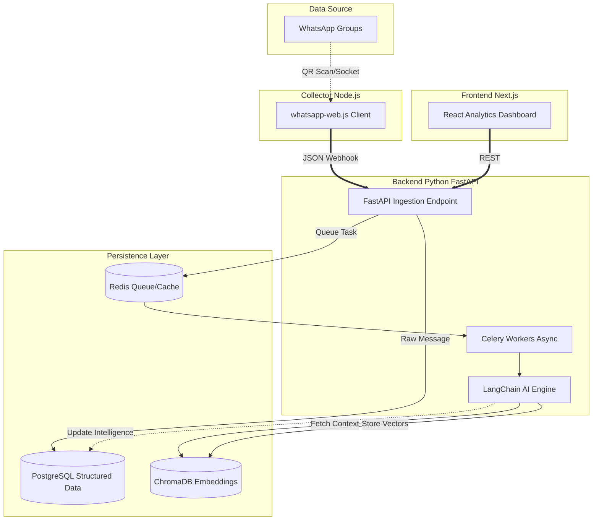
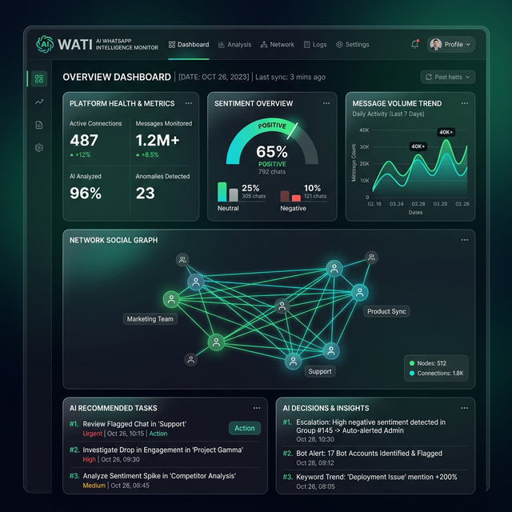

<div align="center">
  

  <br/>

  <h1>💬 AI WhatsApp Intelligence</h1>
  <p><b>Real-Time Group Chat Monitor & Intelligence Hub</b></p>
  <i>Extract decisions, track sentiment, surface tasks, and generate insights autonomously using LangChain and LLMs.</i>
  
  <br/>
  
  [](https://python.org)
  [](https://fastapi.tiangolo.com/)
  [](https://nextjs.org)
  [](https://langchain.com)
</div>

---

## 📑 Table of Contents
- [🌟 Overview](#-overview)
- [🚀 Enterprise Features](#-enterprise-features)
- [🏗️ System Architecture](#️-system-architecture)
- [🛠️ Quick Start Guide](#️-quick-start-guide)
- [📸 Portfolio Preview](#-portfolio-preview)
- [🔒 Privacy & Security](#-privacy--security)
- [🤝 Contributing](#-contributing)

---

## 🌟 Overview

The **AI WhatsApp Group Intelligence Monitor** is an enterprise-grade stack that seamlessly connects to your WhatsApp account, listens to designated group chats, and uses AI to transform raw conversation logs into highly structured, actionable intelligence.

Perfect for teams, communities, and digital agencies who need to extract the "signal from the noise" in high-volume chat environments without constantly reading hundreds of messages.

---

## 🚀 Enterprise Features

* **📡 Headless WhatsApp Collector:** Uses `whatsapp-web.js` to securely listen to groups without draining your phone battery. Features HTTP Keep-Alive connection pooling for enhanced webhook dispatch throughput.
* **🤖 Cognitive AI Engine:** Powered by LangChain and OpenRouter (Anthropic Haiku / OpenAI GPT-4o).
* **🎯 Message Classification:** Automatically flags messages as `Task`, `Decision`, `Question`, or `Announcement`.
* **🧠 Vector Memory Tracking:** Integrates **ChromaDB** for semantic search and topic tracking over time (e.g. "What did we decide about the UI design last week?").
* **📊 Gorgeous Analytics Dashboard:** A glassmorphic, modern UI built with Next.js and TailwindCSS to visualize the chat data.
* **📬 Intelligent Insights:** Generates daily & weekly AI summaries (Who said what, key outcomes, overall sentiment trajectory).
* **🗜️ High-Performance API:** FastAPI backend uses `GZipMiddleware` to compress large JSON responses, saving network bandwidth and reducing latency for dashboard analytics.

---

## 🏗️ System Architecture

The system is decoupled into three massively scalable microservices, orchestrated via Docker.



---

## 🛠️ Quick Start Guide

### 1. Prerequisites
- Docker & Docker Compose installed
- Node.js 20+
- Python 3.11+
- An OpenAI or OpenRouter API key

### 2. Infrastructure Setup
Spin up PostgreSQL, Redis, and ChromaDB:
```bash
docker-compose up -d
```

### 3. Backend (FastAPI + AI Engine)
```bash
cd backend
python -m venv venv
source venv/bin/activate  # or venv\Scripts\activate on Windows
pip install poetry
poetry install

# Populate mock data for testing (optional)
python seed.py

# Start the API server
uvicorn app.main:app --reload --port 8000
```

### 4. Collector (Node.js WhatsApp Client)
```bash
cd collector
npm install
node src/index.js
# Scan the QR code in your terminal with your phone!
```

### 5. Frontend Dashboard (Next.js)
```bash
cd frontend
npm install
npm run dev
# Open http://localhost:3000
```

---

## 📸 Portfolio Preview
*(The glassmorphic intelligence dashboard running locally)*

<div align="center">
  
</div>

---

## 🔒 Privacy & Security

By default, this system stores **all data locally** in your own Postgres/ChromaDB instances. AI inferences can be configured to use local LLMs (via Ollama or Llama.cpp) through LangChain instead of cloud providers, ensuring end-to-end privacy for sensitive company chats. No messages are stored externally.

---

## 🤝 Contributing

We welcome contributions to make the intelligence hub even smarter.
- 🐛 **Found a bug?** Open an issue.
- ✨ **Have a feature idea?** Submit a PR (e.g., adding Telegram or Discord adapters).

---
*Built by a creative vibe coder with ❤️ and AI.*
